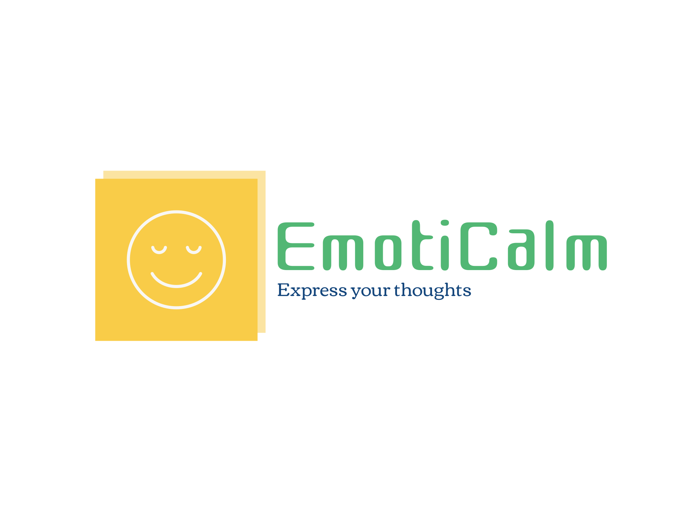

# EmotiCalm - Sistem Kesehatan Mental dan Peningkatan Keseharian Individu

## Daftar Isi
- EmotiCalm? Apa itu?
  - Alasan Dasar Pembuatan EmotiCalm
  - Bagaimana Membuat Diary Harian?
  - Bagaimana Membuat Forum Diskusi?
- Backend 
- Akses Kode EmotiCalm 
  - Persiapkan Hal Berikut Sebelum Clone 
    1. Clone Repository EmotiCalm
    2. Buka Repository di IDE Favoritmu
    3. Install Dependencies (libraries) yang diperlukan
  - Jalankan Kode EmotiCalm
- Teknologi / Libraries yang Digunakan
- Creator

## EmotiCalm Apa Itu?
<div align="justify">
EmotiCalm merupakan sebuah platform yang mendukung pengguna dalam meningkatkan kesejahteraan mental pengguna. Adapun fitur utama dari aplikasi ini adalah <span><strong>My Diary</strong></span> yang merupakan diary harian pengguna
yang dapat merefleksikan bagaimana dinamika dari suasana hati pengguna dalam seminggu terakhir. Sehingga diharapkan melalui fitur ini pengguna dapat merefleksikan bagiamana kondisi keadaan hati pengguna.
Selain fitur <span><strong>My Diary</strong></span>, fitur lainnya adalah <span><strong>Forum Discussion</strong></span>. Pada <span><strong>Forum Discussion</strong></span> pengguna dapat berbagi pemikiran dan memberi dukungan satu sama lain, menciptakan semangat komunitas yang solid.
EmotiCalm berkomitmen untuk memanfaatkan teknologi guna meningkatkan kesadaaran dan mendukung kesehatan mental pengguna.
</div>

### Alasan Dasar Pembuatan EmotiCalm
<div align="justify">
Masalah Kesehatan Mental baru baru ini sudah marak beredar terutama pada generasi muda atau dikenal dengan Gen Z saat ini. Kebangkitan teknologi
digital, tekanan akademik, ketidakpastian ekonomi, dan isolasi sosial semuanya berkontribusi besar terhadap meningkatnya angka gangguan kesehatan mental di kalangan generasi muda. Berdasarkan statistik dari Badan Pusat Statistik (BPS)
yang melakukan sensus terhadap jumlah penduduk berumur lima tahun ke atas yang memiliki masalah kejiwaan atau mental pada tahun 2022 yang berumur 15 -
19 tahun sebanyak 3905 jiwa dan pada usia 20 - 24 tahun sebanyak 4923 jiwa. Adapun masalah yang sering dihadapi oleh remaja atau Gen Z saat ini adalah
kecemasan, depresi, stress, dan sebagainya. Berangkat dari permasalahan tersebut, kami berkomitmen untuk membuat suatu website yang dapat menurunkan 
angka kesehatan mental di Indonesia.
</div>

### Bagaimana Membuat Diary Harian? 
<div align="justify">
EmotiCalm menyediakan fitur membuat diary harian dan terdapat fitur sorting berdasarkan mood atau suasana hati pengguna mulai dari Happy, Normal, Sad.
Namun, sebelum menggunakan fitur <strong>My Diary</strong> pengguna diharapkan untuk melakukan proses pembuatan akun dan masuk ke akun (login) terlebih dahulu.
</div>

### Bagaimana Membuat Forum Diskusi?
<div align="justify">
Untuk menggunakan fitur forum diskusi pengguna diharapkan melakukan pembuatan akun (jika belum mempunyai akun pada platform emoticalm) dan login menggunakan akun yang sudah terdaftar.
Pengguna dapat menambahkan topic baru sesuai dengan keresahan yang dirasakan pada saat ini. Pengguna juga dapat membalas forum atau topic pengguna lainnya sehingga terjadi proses timbal balik yang memberikan solusi atau semangat kepada pengguna yang lainnya.
</div> <br>

> Mohon Pengguna Refresh Ulang Website Ketika Sudah Mengirim atau Membalas Forum
## Backend
<div align="justify">
Emoticalm menggunakan metode fetch untuk menangani permintaan HTTP. Selain itu, untuk manajemen request dan response pada pengiriman data menggunakan Express.js dan database menggunakan MongoDB.  
</div>

## Akses Kode Emoticalm
<div align="justify">
  Berikut cara untuk import/clone proyek EmotiCalm dalam perangkatmu!
</div>

### Persiapkan Hal Berikut Sebelum Clone Project Emoticalm
Pastikan Kamu sudah menginstall software berikut pada perangkatmu:
- [Node.js](https://nodejs.org/en)
- [NPM](https://www.npmjs.com/)
 
1. Clone Repository EmmotiCalm
   Clone Repo Emoticalm dengan mendownload Zip file dari repository branch (main) atau dengan menjalankan perintah berikut pada terminal
   ``` bash
   git clone https://github.com/farhanScripts/EmotiCalm.git
3. Buka Repository di IDE Favoritmu
   Silahkan Buka Aplikasi Visual Studio Code atau IDE lainnya.
5. Install Dependencies (libraries) yang diperlukan
   ``` bash
   npm install

### Jalankan Website
Untuk menjalankan website dengan localhost ketik perintah berikut pada git bash
``` bash 
npx nodemon app.js
```

## Teknologi  Libraries yang Digunakan
- Express
- MongoDB
- Mongoose
- Passport.js
- Affirmation.dev (API)
- Nodemon
- Socket.io
- EJS (Templating Engine)
- EJS-Mate

## Creator
- Farhan Putra
- Hafid Nurmajid
- Naufal Prayoga

## Didukung Oleh
**Dicoding Indonesia**
